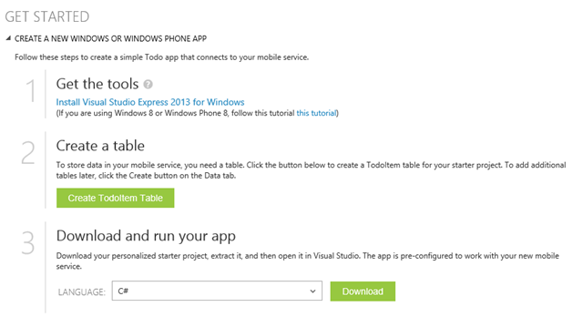
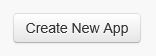

Prerequisites
=============

To complete the exercises in this lab, you will need the following:

- An Azure Account. You can get a free account at http://azure.microsoft.com/en-us/pricing/free-trial/.
- A computer running Windows 8.1
- A licensed copy of Visual Studio 2013
- An Internet connection

Introduction
=============

Storing data in the cloud allows your application to remember information between launches and to share data among other users, applications, and devices.

Exposing that data via a REST interface makes this data accessible to applications running on a variety of platforms and written in a variety of languages. REST is an architectural pattern for allowing clients to read and update server data through a consistent API. The current implementations of REST uses an HTTP endpoint (a URL) to expose functionality and the features of HTTP (verbs, response codes, and header data) to exchange data between the client and the server.

Azure Mobile Services (ZuMo) makes it easier to expose your data as a REST endpoint by handling the "plumbing" code for you so that you can focus on your data model and your business logic.

With just a few clicks, you can create a service and map it to a database table. ZuMo will create an HTTP endpoint; map HTTP verbs to Create, Read, Update, and Delete methods; create those methods for you; and handle the transformation from JSON data into objects that map to rows in your database table. This isn't impossible code for you to write, but it can be a lot of code. And wouldn't your time be better spent writing the code that makes your application unique?

Azure Mobile Services will even generate a client application to call your new REST service and pass data to and from it. You can use this application as a starting point or you can copy and paste code from this app into your own client app. ZuMo is capable of generating a sample client application for Windows 8, Windows Phone, HTML and JavaScript, Xamarin, PhoneGap, Android, or iOS.

Azure Mobile Services is a true cross-platform solution that is simple to implement because it handles much of the plumbing code for you.

Exercise 1 - Create a Mobile Service
=============

With Azure Mobile Services, developers can quickly create a REST interface to read and write their backend database.

The Azure portal provides a wizard for creating a sample solution built around mobile services in just a few minutes. In this exercise, you will create a new Azure Mobile Service.

Log onto the Azure Portal and select the MOBILE SERVICES icon (Figure 1) in the left menu.

Figure 1

Click the NEW button at the bottom of the screen (Figure 2).

Figure 2

This exposes a menu (Figure 3).

Figure 3

With COMPUTE and MOBILE SERVICES selected (which should already be the case) click the CREATE button.

The "Create a Mobile Service" dialog (Figure 4) displays.

Figure 4

Give a name for the service. The full name will be whatever you type in the URL textbox, followed by ".azure-mobile.net" and it must be unique. The portal will let you know if someone else has chosen the same name. Select an existing database or create a new one; then select the Region where the Mobile Service will live. It makes sense to create the service in the same region where the database resides.

Finally, select the language in which to build the backend service. If you select JavaScript, the server-side solution will be hosted in Node.js. If you select .NET, you can create a solution in Visual Studio and deploy it to Azure, where it will be hosted in IIS.

Click the arrow (Figure 5) at the bottom right of the dialog to advance to the next page, where you can specify database information.

Figure 5

Figure 6 show the page if you elect to connect to an existing database. Select the database connection string; then enter the login name and password with which you will connect to this database.

Figure 6

Click the "Check" button at the bottom right to create the Mobile Service. After a few seconds, the service will show up in the portal as in Figure 7.

Figure 7

Exercise 2: Use the Wizard to Create an App
=============

In the last exercise, you created a new Azure Mobile Service in the portal. In this exercise, you will use a wizard to create an application, consisting of a new table, an HTTP endpoint to access that table, and a sample client application to access the data through that endpoint.

Log onto the Azure Portal and select the MOBILE SERVICES icon in the left menu. Figure 1 shows the Mobile Service we created last time.

Figure 1

Click the arrow next to the service name to display details about the service (Figure 2).

Figure 2

Notice the choices you have next to "CHOOSE A PLATFORM". The Platforms listed are the various client platforms explicitly supported by Mobile Services. Remember that Mobile Services exposes data via standard interfaces such as HTTP and JSON which can be used by a wide variety of platforms and languages.

For this exercise, click the "Windows" button; then expand the "CREATE A NEW WINDOWS APP" link. This will reveal the 3 steps to get you started building an application around Azure Mobile Services (Figure 3).

Figure 3

Get the tools (Figure 4) allows you to download a free version of Visual Studio. If you already have any version of Visual Studio 2013 installed, you can skip this step.

Figure 4

The "Create a table" step (Figure 5) allows you to create a sample SQL Server table. Click the green button to create a new table named "TodoItem" in your database with columns to keep track if the tasks you need to do today and whether you have completed each task.

Figure 5

The "Download and run your app" step (Figure 6) will generate client code that will connect to your application.

Figure 6

Select C# as your language and click the [Download] button to download a ZIP file containing a Universal App that includes a Windows 8.1 project, a Windows Phone 8.1 project, and a Shared Code project. These projects will contain a user interface written in XAML and C# code-behind. Figure 7 shows the results of C#/XAML project generated by Azure Mobile Services.

Figure 7

Compile the solution by selecting BUILD | Rebuild Solution from the menu.

In this lab exercise, we saw how to run the Azure Mobile Services wizard to generate a sample table and client application.

Exercise 3: Exploring the Sample Client Universal App
=============

In this exercise, you will look at code and strive to understand it; but you will not be changing any code.

Launch Visual Studio 2013 and open the application you created in Exercise 2.

Figure 1 shows the solution, which includes a Windows 8.1 project, a Windows Phone 8.1 project, and a project with files that are shared by the other two projects.

Figure 1

Launch the Apps
---------------

Compile the application by selecting Build | Build Solution from the Visual Studio menu.

Because this is a Universal app, it contains both a Windows 8.1 and a Windows Phone 8.1 project. The two projects do pretty much the same thing but each has a user interface appropriate to its own platform. To select which project will run when you press F5, right-click the desired project in Solution Explorer and select "Set as SartUp project" from the context menu.

Run the application by pressing the F5 key on your keyboard.

A screen shot of each running app is shown in Figure 2 (Windows 8.1) and Figure 3 (Windows Phone 8.1). As you can see, this app keeps track of a user's To Do List. The list of "To Do Items" is stored in an Azure SQL Database, which is exposed via Azure Mobile Services.

Figure 2

Figure 3

You can see that the apps look similar because they have the same functionality. The differences are related to the size, layout, and other considerations of the specific platform on which they run. Play with each app and you will see that they function about the same, thanks to the large percentage of shared code.

Explore the Code
---------------

In the Solution Explorer, expand the Shared project. This is where most of the interesting stuff happens.

# TodoItem.cs #

Double-click the TodoItem.cs node in the DataModel folder of the Shared project.

Let's look first at the Model. It is in the Shared project because both apps use the same model. (Listing 1).

>     public class TodoItem

>     {

>        public string Id { get; set; }

>        [JsonProperty(PropertyName = "text")]

>        public string Text { get; set; }

>        [JsonProperty(PropertyName = "complete")]

>        public bool Complete { get; set; }

>     }

Listing 1

The three properties (Id, Text, and Complete) will map to columns in the SQL Server table. The _Text_ and _Complete_ properties are decorated with the JsonProperty attribute, which is found in the Newtonsoft.Json library and tells .NET how to name these properties when an object is transformed into the JSON format. Strictly speaking, this is unnecessary, but JSON objects tend to follow the JavaScript convention of Camel casing.

# App.xaml.cs #

Now open App.xaml.cs in the Shared project by double-clicking the node in Solution Explorer. You may need to expand App.xaml to see this node.

The shared App.xaml.cs takes care of some basic processing when an app starts up, suspends, or has a problem.

As far as Azure Mobile Services is concerned, the important line is the MobileService field declaration (Listing 2)

>     public static MobileServiceClient MobileService   

>       = new MobileServiceClient(

>           "https://giard1119.azure-mobile.net/",

>           "HKLNiAbDvDzodcZJHkKvncFZPkiWke98"

>     );

Listing 2

The second parameter of the MobileServiceClient constructor is the application key generated by your Mobile Service. Passing the Application Key to the constructor of our MobileServiceClient is necessary if we set permissions to only allow calls to the mobile service by clients that provide the Application Key. Whenever we call the REST service with this object, the Application Key will be passed in the header of HTTP calls to the mobile services endpoints.

This static class is available throughout the application and contains methods to communicate with your mobile service. Its main use is to create an IMobileServiceTable by calling the static object's GetTable() method, which is done in the MainPage.

# MainPage.cs #

Open the MainPage.cs class by double-clicking this node in the Solution Explorer.

Notice that all three projects contain the MainPage class, which derives from the Page object. In both the Windows project and in the Windows Phone project, this class is in the MainPage.xaml.cs file, while the class is in the MainPage.cs file in the shared project. Notice also that these are all "partial" classes and that each is in the same namespace. At compile time, both the Windows and Windows Phone projects will pull in the class from the Shared Project and use its code.

At the top of the MainPage class is the creation of two sets of our model (Listing 3).

>     private MobileServiceCollection<TodoItem, TodoItem> items;

>     private IMobileServiceTable<TodoItem> todoTable   

>          = App.MobileService.GetTable<TodoItem>();

Listing 3

_MobileServiceCollection_ items is simply a collection on the client that is used to bind to a _ListView_ control in our XAML named ListItems. 

The IMobileServiceTable interface has methods to interact with the REST API specified when the MobileService was created (which is our Azure Mobile Service API). So, the todoTable object has implementations of these methods specific to our service.

For example, the InsertTodoItem method makes a call to todoTable.InsertAsync() and passes an instance of the TodoItem. This calls our Azure Mobile Service REST endpoint (in my case, that endpoint is https://giard.azure-mobile.net/Tables/todoitem), using the POST Verb and passing

We can use Lync extension methods of todoTable to retrieve specific data into the todoTable object as in Listing 4 (from the RefreshTodoItems() method), which retrieves only todoItems for which the Boolean field Complete is FALSE.

>     items = await todoTable

>        .Where(todoItem => todoItem.Complete == false)

>        .ToCollectionAsync();

Listing 4

Search for all methods using the todoTable object to view the .NET syntax to call the REST mobile service.

The shared code takes advantage of the fact that the events fired in Windows and in Windows Phone are very similar and that the similar objects with similar names and events are created in the MainPage.xaml of each project. Because of this, the shared project can even contain event handlers that are appropriate for either project. For example, Listing 5 is the event handler when you click a checkbox next to an item on either the phone or your Windows PC/Tablet to mark that item as "Complete".

>     private async void CheckBoxComplete_Checked(object sender, RoutedEventArgs e)

>     {

>         CheckBox cb = (CheckBox)sender;

>         TodoItem item = cb.DataContext asTodoItem;

>         await UpdateCheckedTodoItem(item);

>     }

Listing 5

This event handler passes the checked item to the UpdateCheckedTodoItem method, which uses the todoTable object to call the REST endpoint (Listing 6).

>     private async Task UpdateCheckedTodoItem(TodoItem item)

>     {

>         await todoTable.UpdateAsync(item);

>         items.Remove(item);

>         ListItems.Focus(Windows.UI.Xaml.FocusState.Unfocused);

>     }

Listing 6

Conclusion
----------

Notice how much of the application logic was moved into the Shared project. This isn't surprising because both the Phone app and the Windows app do the same thing - but with different user interfaces. It should be your goal to push as much of our app as you can into the Shared project.

When you build your own app, you will almost certainly use a different model and a different user interface. However, the samples code in this generated application should provide you a template for how to do basic operations on your mobile service, such as Read, Write, Update, and Delete. Make sure you understand the sample; then copy the appropriate code into your application and modify it to fit your model.

Exercise 4: Implementing Single Sign-On
==================

In a previous exercise, you created a sample .NET client application to connect to your Azure Mobile Service. In this exercise, you will add authentication to this sample application.

Azure Mobile Services supports a number of different methods of authentication. A couple of them you would expect from a Microsoft platform - User can be authenticated against Active Directory or they can be directed to log in with a Microsoft account (formerly known as a "Live" account.) You would expect Mobile Services to support these authentication methods because they are created and/or maintained by Microsoft. However, Mobile Services is designed to accept authentication tokens that adhere to the OAuth standard and it is built to support Facebook, Twitter, and Google authentication - all of which conform to oAuth.

In order to use an Authentication Provider, you must enable support for that provider. You can enable support for one provider and instruct all clients to use that provider; or you can enable support for multiple oAuth providers and clients will be able to offer a choice to users, allowing them to log in with their favourite service.

Setting up each of these oAuth providers is pretty similar, so the best way to show you how is to walk through an example. We will enable Twitter authentication but the process is not much different for other providers.

Creating an App on Twitter
----------------------

In order to allow users to log into your app via Twitter, you need to create an app in Twitter. You can do so by navigating to [http://dev.twitter.com](http://dev.twitter.com) and signing in with your Twitter credentials (you may need to create a Twitter account first. If so, you may be the last person on Earth to do so.) At the bottom of the page is a "Tools" section. Click the "Manage Your Apps" link in this section, as shown in Figure 1.

Figure 1

On the "Twitter Apps" page, click the [Create New App] button (Figure 2).

Figure 2

The "Create an application" page (Figure 3) displays. The first 3 fields are required.

Figure 3

At the "Name" field, enter a name for your application. I usually use the same name I gave my Azure Mobile Service.

At the "Description" field, enter a brief description of your app.

At the "Website" field, enter your Mobile Service URL. You can find this URL in the Azure portal on the DASHBOARD tab of your Mobile Service (Figure 4)

Figure 4

Scroll down the "Create an Application" page (Figure 5), read the Developer agreement completely (in this case, you are likely the first person ever to do this), check the "Yes I agree" checkbox, and click the [Create your Twitter application] button to create the app.

Figure 5

A page displays for your newly-created app with a tab menu across the top as shown in Figure 6.

Figure 6

Click the "Keys and Access Tokens" tab to display the Application Settings as shown in Figure 7.

Figure 7

You will need the Consumer Key (API Key) and the Consumer Secret (API Secret) so keep this web page open and open a new browser or browser tab and navigate to the Azure Portal.

In the Azure Portal, select your mobile service and click the IDENTITY menu option as shown in Figure 8.

Figure 8

On the IDENTITY page, scroll down to the "twitter settings" section. From the Twitter "Application Settings" page, copy the API Key and the API Secret and paste these values into the corresponding fields on the Azure Mobile Services IDENTITY page, as shown in Figure 9.

Figure 9

Click the SAVE icon (Figure 10) at the bottom of the page to save these changes.

Figure 10

Your Mobile Service now supports Twitter authentication.

Force clients to login before accessing your service by setting permissions on the service actions. This is done at the Mobile Service table's PERMISSIONS page. (To access the PERMISSIONS page, select your Mobile Service in the Azure Portal; click the DATA tab; select the table you want to secure; and click the PERMISSIONS tab.)

Change the permission of each action to "Only Authenticated Users" by selecting "Only Authenticated Users" from the dropdown next to each action, as shown in Figure 11. Click the SAVE icon to commit these changes.

Figure 11

Now any client app that calls your service has no choice but to force users to log in with Twitter in order to use your app.

Client App
----------

Open the client app that we created in an earlier article and open MainPage.cs in the Shared project.

Add the following code to the class, outside of any method:

>     MobileServiceUser user = null;

>     private async System.Threading.Tasks.Task AuthenticateAsync()

>     {

>         while (user == null)

>         {

>             user = await App.MobileService

>                 .LoginAsync(MobileServiceAuthenticationProvider.Twitter);

>         }

>     }

Listing 1

Then call this method by adding the following line at the top of the OnNavigatedTo method

>     await AuthenticateAsync();

Listing 2

Save and compile the solution.

Set the Windows 8.1 app as the startup project and press F5 to run the application. You should be directed to Twitter and forced to log in before you can use the app.

When the user navigates to the MainPage, she will be redirected to the Twitter login page where she must successfully login before proceeding. The MobileService will remember the user and pass this information in a token with each request to the REST service. If you configure another authentication provider, such as Google or Microsoft, you can direct the user to that provider's login page by changing the MobileServiceAuthenticationProvider enum, which is passed as a parameter to the MobileService.LoginAsync method.
